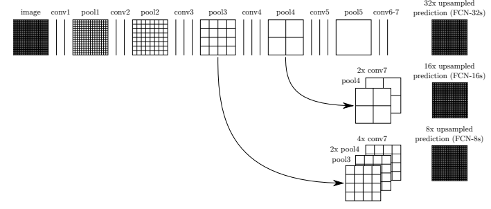
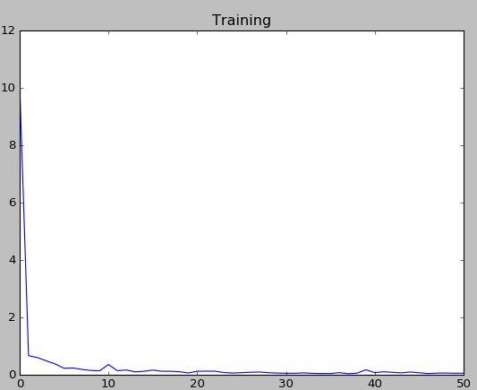
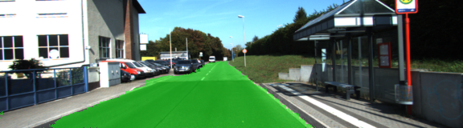
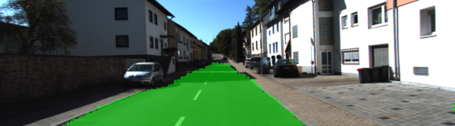
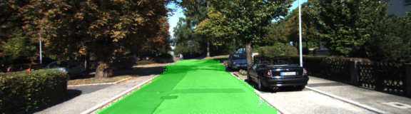
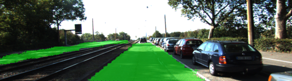

# Semantic Segmentation
The task in this project is to classify if a pixel in an image is road pixel or non road pixel. A fully convolutional network is used to perform this task.

### Network Architecture
The fully convolutional network is built upon a pretrained VGG16 network in order to take advantage of transfer learning which will decrease the training duration.

To the output layer of VGG16,a 1X1_convlolution layer is applied in order to retain the spatial information and to reduce number of channels from 4096 to 2(This process is applied for 3rd adn 4th pooling layers as well to bring down the number of channels to 2). 
A transpose convolutional layer is applied to the resultant tensor in order to double the height and width of the tensor. The resultant tensor is added to the 4th pooling layer.

A transpose convolution layer is applied to the above sum in order to double the height and width of the tensor. The resultant tensor is added to the 3rd pooling layer.

A transpose convolutional layer is applied to the resultant tensor such that the height and width are increased 8 folds. The dimension of thus applied tensor will be same as dimension of input image

### Network Training
The network is trained for 50 epochs with a batch size of 5. Each batch is randomly choosen from the training data in such a way that each epoch will go through all the training data once
The following is the plot of training loss over 50 epochs

### Samplet Network Outputs
The trained network is used to classify testing data in Kitti Road Dataset. The following are few sample network output images

### Network Output into a video
All the network output are concatenated into a video by Images2Video.py
[Network output video >>](SemanticSegmentation.avi)

